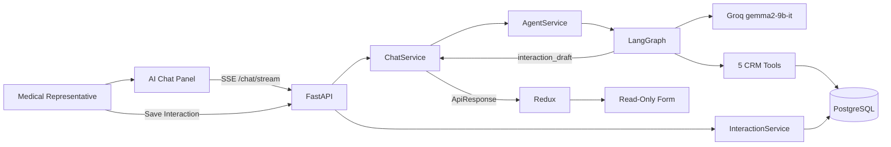
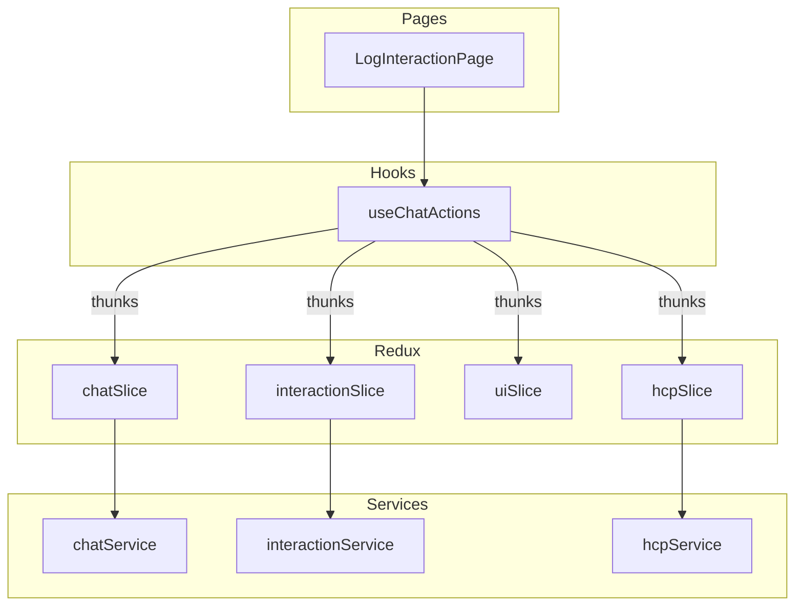
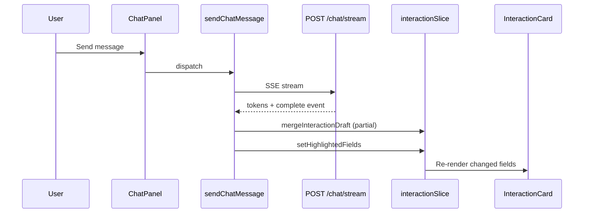
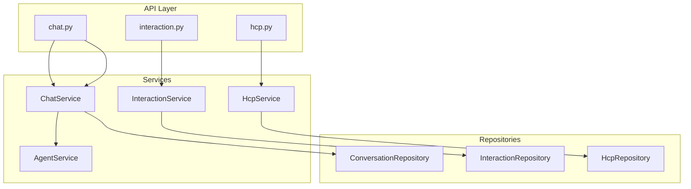
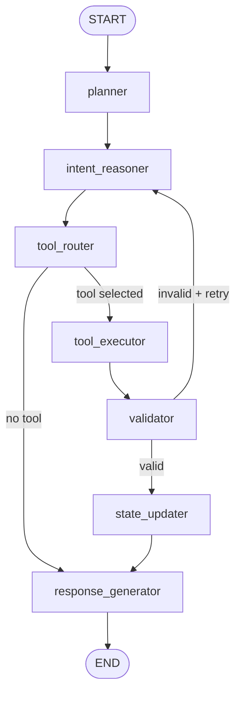
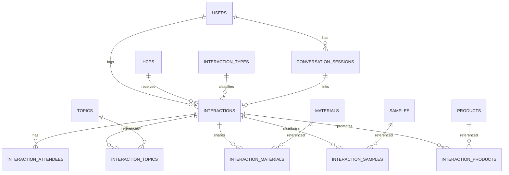
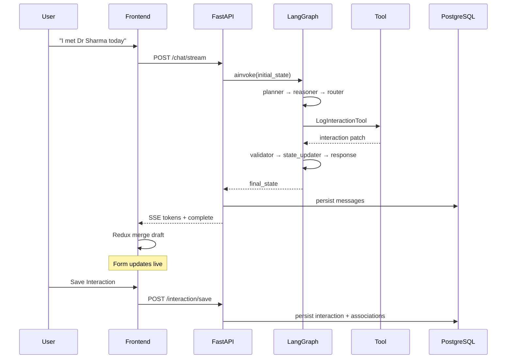

# Architecture Documentation

## Overall System Architecture

## Frontend Architecture

### Redux Flow

## Backend Architecture

### Dependency Injection

- `core/dependencies.py` — settings, DB session, services, auth placeholder
- `RequestContextMiddleware` — correlation ID, request timing
- Global exception handlers — consistent `ApiResponse` envelope

## LangGraph Flow

### State Schema

| Field | Purpose |
|-------|---------|
| `messages` | LangChain message history |
| `current_interaction` | Interaction draft dict |
| `current_hcp` | Selected HCP context |
| `selected_tool` | Last executed tool |
| `interaction_status` | draft / completed |
| `validation_errors` | Business validation notes |
| `memory` | Turn count, last tool, summaries |

### Routing Rules

- **No keyword matching** — `routing.py` uses LLM structured outputs only
- `route_after_router` — checks `should_execute_tool` and `ToolName`
- `route_after_validation` — retry loop with `LLM_MAX_VALIDATION_RETRIES`

## Database ER Diagram

## AI Workflow

## Prompt Engineering Layer

Located in `backend/app/prompts/` (separate from LangGraph nodes):

| Module | Used By |
|--------|---------|
| `system_prompt.py` | All LLM calls |
| `planner_prompt.py` | Planner node |
| `intent_prompt.py` | Intent reasoner |
| `router_prompt.py` | Tool router |
| `log_interaction_prompt.py` | LogInteractionTool |
| `edit_interaction_prompt.py` | EditInteractionTool |
| `search_hcp_prompt.py` | SearchHCPTool |
| `materials_prompt.py` | MaterialsAndSamplesTool |
| `followup_prompt.py` | OutcomeAndFollowupTool |
| `validation_prompt.py` | Validator node |
| `response_prompt.py` | Response generator |

All tools use **Pydantic structured outputs** via Groq.

## Performance Considerations

| Area | Strategy |
|------|----------|
| Frontend | `React.memo` on MessageBubble, InteractionCard; lazy routes |
| Redux | Partial draft merge; field-level highlights |
| API | Axios retry for transient failures |
| Database | Indexes on HCP, interaction date, conversation |
| LangGraph | Lazy graph compilation; 8-message memory window |

## Security Architecture

| Control | Implementation |
|---------|----------------|
| Auth placeholder | `get_current_user()` + `X-User-Id` |
| Input validation | Pydantic v2 on all endpoints |
| SQL injection | SQLAlchemy parameterized queries |
| CORS | Configurable origins |
| Error exposure | Sanitized ApiErrorResponse |
| Secrets | Environment variables only |
